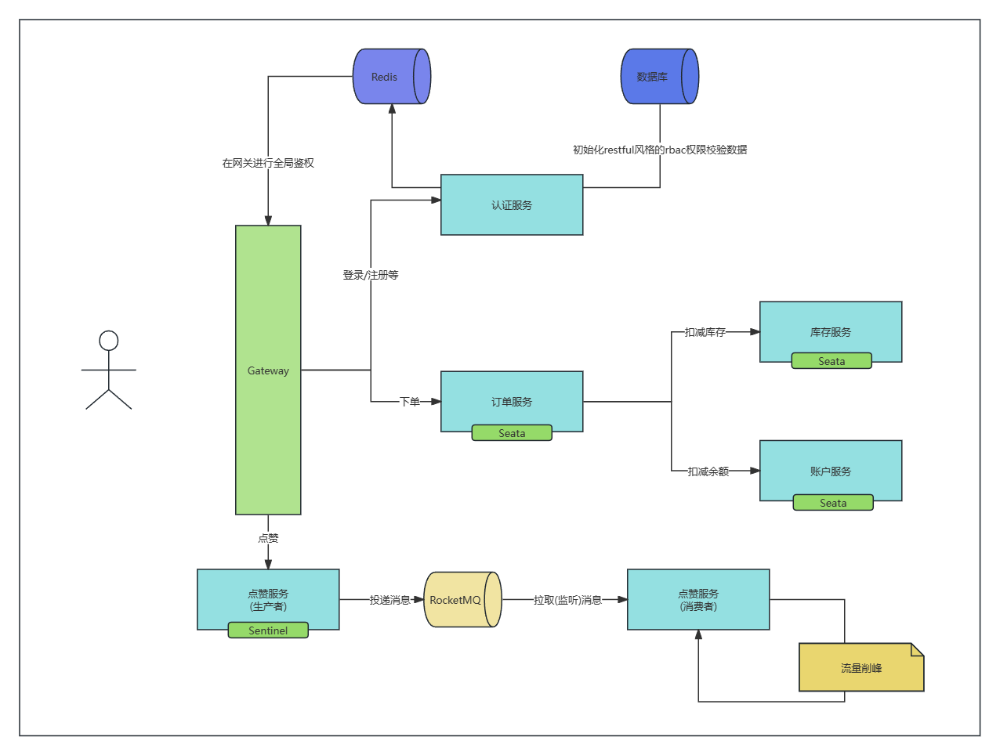

# Spring Cloud Template
## 项目说明
本项目为 个人开发学习项目，主要用于学习 SpringCloud Alibaba 相关技术栈的使用，可以用于快速进行Spring Cloud Alibaba开发。

供团队开发参考。

架构参考Spring Cloud Alibaba Integrated Example最佳实现

主要使用的组件及其使用特性如下：
* Spring Cloud Gateway 网关
* Nacos 配置中心和服务注册中心
* Sentinel 熔断限流
* Seata 分布式事务
* RocketMQ 消息队列削峰填谷

## 应用场景说明
在本 demo 示例中，提供了两种业务场景。
1) 用户下单购买货物的场景，下单后：

- 先请求库存模块，扣减库存

- 扣减账户余额

- 生成订单信息返回响应

2) 用户为商品进行点赞（模拟 MQ 的生产者消费者应用场景）返回商品点赞后的详细信息（点赞数等）。

### 组件详细说明

1) 其中，用户下单购买货物的场景主要使用 Seata 来进行分布式事务的能力体现。

2) 用户为商品进行点赞的场景，模拟大流量环境下通过 Sentinel 进行限流或是 RocketMQ 进行削峰填谷。在此场景下，SCA社区提供了两种应对大流量的处理方式：

  - Sentinel 在网关侧绑定指定网关路由进行服务的熔断降级。

  - RocketMQ 进行流量削峰填谷，在大流量请求下，生产者向 RocketMQ 发送消息，而消费者则通过可配置的消费速率进行拉取消费，减少大流量直接请求数据库增加点赞请求的压力。

#### Spring Cloud Gateway

微服务模块的网关。

Spring Cloud GateWay 整合 Nacos,实现动态路由配置。

通过监听 Nacos 配置的改变，实现服务网关路由配置动态刷新，每次路由信息变更，无需修改配置文件而后重启服务。

#### Nacos

各个微服务的配置中心，服务注册中心。

- 配置中心
  - 共享配置：MySQL 数据源相关信息配置。

- 注册中心
  - 所有的微服务模块都注册到 Nacos 中进行服务注册与发现。
  - 整合 Spring Cloud Gateway 网关。

#### Seata

基于 Seata 的 AT 模式，用于库存模块，账户模块，订单模块的分布式事务处理。

只要库存不足/账户余额不足，回滚事务。

#### Sentinel

用于点赞场景的服务熔断限流。

整合 Nacos 配置中心与 Spring Cloud Gateway，实现指定路由规则熔断限流规则动态配置。

#### RocketMQ

用于进行点赞服务流量的削峰填谷。

通过将大流量的点赞请求从生产者发送到 mq，消费者模块从 mq 中拉取进行一定频率的消费，不是简单的直接服务熔断限流降级，实现 RocketMQ 针对大流量的削峰填谷能力。

## 使用文档
可以参考, [Demo开发文档](./docs/operate/开发指南.md)

## 参考文档
* [Springcloud Alibaba 最佳实现](https://sca.aliyun.com/zh-cn/docs/2022.0.0.0/best-practice/integrated-example/#%E5%85%B6%E4%BB%96)
  * [最佳实现说明](https://github.com/alibaba/spring-cloud-alibaba/blob/2022.x/spring-cloud-alibaba-examples/integrated-example/docs/zh/readme-zh.md)
  * [本地化部署最佳实现](https://github.com/alibaba/spring-cloud-alibaba/blob/2022.x/spring-cloud-alibaba-examples/integrated-example/docs/zh/local-deployment-zh.md)
  * [容器化部署最佳实现](https://github.com/alibaba/spring-cloud-alibaba/blob/2022.x/spring-cloud-alibaba-examples/integrated-example/docs/zh/docker-compose-deploy-zh.md)
* [Nacos官方文档](https://nacos.io/zh-cn/docs/quick-start.html)

TODO:
* nacos导入脚本

