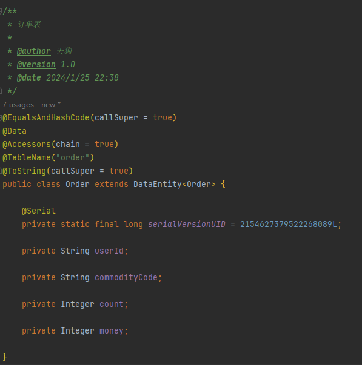

## 前言
希望开发时都能遵守一定的规范，以保证代码的可读性和可维护性。现在我们介绍一些开发时的一些规范和注意事项。
* 在开发时，在类前应编写详细的注释，包括类的作用、作者、版本、时间等信息，可以在Idea中配置模板，以便快速生成注释
  
* 可序列化的对象需要显示定义`serialVersionUID`，并添加`@Serial`注解，以便在反序列化时保证版本一致
  * 可以在Idea中配置警告，以提醒并便于快速生成`serialVersionUID`
  
* 服务编写应先定义接口类，并附以较为详细的注释，以便后续维护
* 工具类使用
  * 使用springframework提供的`!StringUtils.hasLength()`判断字符串是否为空，而不是使用String的isEmpty方法
  * 使用springframework提供的`!CollectionUtils.isEmpty()`判断集合是否为空，而不是使用Collection的isEmpty方法
  * 使用common模块封装的BeanCustomerUtils工具类来拷贝对象，而不是使用BeanUtils工具类
* 可以为Idea安装`Github Copilot`插件，以便快速生成代码(会基于已有代码生成新代码，需要自己检查生成的代码是否符合规范)
* 此处未提到的规范，可参考`《阿里巴巴Java开发手册》`，并强烈推荐在Idea中安装Alibaba规约检查插件

## 项目基本结构
以下仅展示可能的目录，有需要可自行扩展
```text
.                 
├─src               
│  ├─main           
│  │  ├─java        
│  │  │  └─com      
│  │  │      └─noop
│  │  │          ├─controller   // 控制器
│  │  │          ├─feign        // 远程feign调用,调用其他微服务
│  │  │          │  ├─dto           // 用于feign远程接口入参
│  │  │          │  └─impl          // 调用异常fallback实现类
│  │  │          ├─mapper       // 数据库交互
│  │  │          ├─model        // 模型
│  │  │          │  ├─dto           // controller接收前端数据用的模型
│  │  │          │  ├─entity        // 数据库模型
│  │  │          │  └─vo            // 返回给前端的数据模型
│  │  │          ├─listener     // 监听器
│  │  │          ├─filter       // 过滤器
│  │  │          └─service      // 业务逻辑
│  │  │              └─impl         // 业务逻辑实现
│  │  └─resources   // 资源目录
│  └─test       // 单元测试
│      └─java

```
## 依赖引用
### 基本依赖
```pom.xml
<!-- 基础依赖,包含了大部分公用依赖，具体可在common模块查看 -->
<dependency>
    <groupId>com.noop</groupId>
    <artifactId>springcloud-template-common</artifactId>
    <version>1.0-SNAPSHOT</version>
</dependency>
<!-- SpringBoot整合Web组件 -->
<dependency>
    <groupId>org.springframework.boot</groupId>
    <artifactId>spring-boot-starter-web</artifactId>
    <exclusions>
        <!-- 排除自带的logback依赖 -->
        <exclusion>
            <groupId>org.springframework.boot</groupId>
            <artifactId>spring-boot-starter-logging</artifactId>
        </exclusion>
    </exclusions>
</dependency>
```
### Seata依赖
在需要用到分布式事务的场景下，调用方和被调用方都需要引入该依赖
```pom.xml
<!-- feign调用其他微服务 -->
<dependency>
    <groupId>org.springframework.cloud</groupId>
    <artifactId>spring-cloud-starter-openfeign</artifactId>
</dependency>
<!-- 负载均衡配置 -->
<dependency>
    <groupId>org.springframework.cloud</groupId>
    <artifactId>spring-cloud-starter-loadbalancer</artifactId>
</dependency>
<!-- 分布式事务Seata -->
<dependency>
    <groupId>com.alibaba.cloud</groupId>
    <artifactId>spring-cloud-starter-alibaba-seata</artifactId>
</dependency>
```
### RocketMQ依赖
在面对大流量的场景下，可以使用RocketMQ来进行消息的异步处理,consumer和provider都需要引入该依赖
```pom.xml
<!-- RocketMQ -->
<dependency>
    <groupId>com.alibaba.cloud</groupId>
    <artifactId>spring-cloud-starter-stream-rocketmq</artifactId>
</dependency>
```


## 业务编写
下面以一个简单的增上改查业务为例，介绍业务开发的一般流程

### 数据库表设计
在设计数据库表时，应该遵循以下原则：
* 表名使用小写字母，单词之间使用下划线分隔
* 表名应该能够体现出表的含义，且尽量简洁
* 表名应该使用单数形式，如`user`而不是`users`
* 应包含主键，且主键名为`id`,类型为`varchar(255)`
* 应包含创建时间和更新时间字段，类型为`datetime`
* 应包含删除标志字段，类型为`char(1)`
* 应包含备注字段，类型为`varchar(255)`

下面是一个例子


### orm封装
在common模块中已经封装了BaseEntity和DataEntity，包含了一些基本的字段，我们在开发时直接继承使用

在编写数据模型时，应包含以下注解
* `@Table`：表名
* `@Data`和`@EqualsAndHashCode(callSuper = true)`：lombok注解，用于生成getter和setter方法，并保证继承关系的一致性
* `@Accessors(chain = true)`：lombok注解，用于生成链式调用方法

以下是一个例子



### mapper编写
这部分很简单，只需要继承mybaits的`BaseMapper`接口，并加上`@Mapper`注解即可，不需要再写具体的方法，mybatis-plus会自动帮我们实现

如果有特殊的sql需求，可以在接口中编写，并通过 `@Select("sql")`等注解来实现


### crud服务封装

我们在common模块中已经封装了CrudService，包含了一些基本的增删改查方法，我们在开发时直接继承使用
以下列出一部分相关方法，更多方法可查看源码


### service编写

在编写service时，首先应该先定义对应服务的接口类，并包含较为详细的注释，下图为一例：


然后在编写实现类时，应该继承CrudService，并实现接口类，同时注意加上`@Service`注解

下图为一例(例中`@GlobalTransactional`注解是用于分布式事务使用的，后续将会详细介绍)：


### dto编写
在类上加上`@Data`注解，用于生成getter和setter方法

在属性上加上`@Schema`注解，用于生成swagger文档

在属性上加上`@NotNull`等注解，用于校验参数，具体使用哪些注解可以根据实际情况自行选择

下面列出一些基本的注解：

| 注解         | 功能                                                         |
| ------------ | ------------------------------------------------------------ |
| @AssertFalse | 可以为null,如果不为null的话必须为false                       |
| @AssertTrue  | 可以为null,如果不为null的话必须为true                        |
| @DecimalMax  | 设置不能超过最⼤值                                           |
| @DecimalMin  | 设置不能超过最⼩值                                           |
| @Digits      | 设置必须是数字且数字整数的位数和⼩数的位数必须在指定范围内   |
| @Future      | ⽇期必须在当前⽇期的未来                                     |
| @Past        | ⽇期必须在当前⽇期的过去                                     |
| @Max         | 最⼤不得超过此最⼤值                                         |
| @Min         | 最⼤不得⼩于此最⼩值                                         |
| @NotNull     | 不能为null，可以是空                                         |
| @Pattern     | 必须满⾜指定的正则表达式                                     |
| @Size        | 集合、数组、map等的size()值必须在指定范围内                  |
| @Email       | 必须是email格式                                              |
| @Length      | ⻓度必须在指定范围内                                         |
| @NotBlank    | 字符串不能为null,字符串trim()后也不能等于“”                  |
| @NotEmpty    | 不能为null，集合、数组、map等size()不能为0；字符串trim()后可以等于“” |
| @Range       | 值必须在指定范围内                                           |
| @URL         | 必须是⼀个URL                                                |

下面提供一个例子


### control编写

在编写controller时，首先注意加上下列注解
* `@Tag`: 用于swagger生成api文档时的分组
* `@SecurityRequirement`: 用于swagger生成api文档时的权限认证(会在请求中包含Authorization头并根据填写的内容填充token)
* `@Slf4j`: 用于生成log对象,可以直接使用log对象打印日志
* `@CrossOrigin`: 用于跨域请求
* `@RestController`: 用于标识该类为controller
* `@RequestMapping`: 用于标识该类的请求路径

接下来需要编写具体的接口方法，注意加上下列注解
* `@Operation`: 用于swagger生成api文档时的接口描述
* `@PostMapping`、`@GetMapping`等: 用于标识该方法的请求方式
* `@Parameters`: 用于swagger生成api文档时的参数描述,如果只有dto在body中传递参数的话可以不用加


注意在参数列表中也需要加入一些注解,下列注解可视情况自行使用
* `@RequestBody`: 用于标识该参数在请求体中,用于传输dto,这个注解需要搭配@Valid注解使用,用于校验dto中的参数
* `@PathVariable`: 用于标识该参数在请求路径中,用于传输路径参数
* `@RequestParam`: 用于标识该参数在请求参数中,用于传输请求参数

在编写接口时，注意先init初始化结果对象，并将从服务中获取的数据封装到结果对象中，最后返回结果对象即可，下图为一例

如果使用dto传输参数，记得进行参数的校验，下面是一个例子
```java
// 参数验证
if (bindingResult.hasErrors()) {
    throw new BusinessException(MsgCodeUtil.MSG_CODE_ILLEGAL_ARGUMENT, MsgCodeUtil.getIllegalArgumentMessage(bindingResult.getFieldErrors()));
}
if (sysUserService.isUsernameDuplicated(dto.getUsername())) {
    return (CommonResult) result.failCustom(MsgCodeUtil.MSG_CODE_SYSTEM_USER_NAME_EXIST, "用户名已存在").end();
}
```


### spring-doc在线api文档
如果使用过swagger的话，会能够轻易的上手spring-doc，我们在网关层配置了服务的订阅监听，所以正常情况下，我们只会用到网关层的spring-doc，并可以跳转到其他服务的api文档(其他服务的api也会先经过网关层处理后在发出)

spring-doc在线api文档的访问地址: `http://gateway:port/swagger-ui/index.html`


下面是他与swagger的一些不同

| Swagger2           | SpringDoc   | 描述                                     |
| ------------------ | ----------- | ---------------------------------------- |
| @Api               | @Tag        | 修饰 controller 类，类的说明             |
| @ApiOperation      | @Operation  | 修饰 controller 中的接口方法，接口的说明 |
| @ApiModel          | @Schema     | 修饰实体类，该实体的说明                 |
| @ApiModelProperty  | @Schema     | 修饰实体类的属性，实体类中属性的说明     |
| @ApiImplicitParams | @Parameters | 接口参数集合                             |
| @ApiImplicitParam  | @Parameter  | 接口参数                                 |
| @ApiParam          | @Parameter  | 接口参数                                 |

## Redis使用

在common模块中已经封装了RedisUtil，包含了一些基本的操作方法，我们在开发时直接继承使用

具体可以查看源码

## Feign使用

Feign用于调用其他服务的接口，我们首先需要在服务的主启动类添加注解`@EnableFeignClients`以启用Feign功能呢,然后在feign包下定义接口，并加上`@FeignClient`注解，并像定义controller类似，加上`@RequestMapping`注解，用于标识请求路径
，这样就可以通过 `@Autowired`注解注入该接口，然后调用接口中的方法来调用其他服务的接口

需要注意，我们应考虑到调用失败的情况，所以需要实现该接口，并显示声明默认的fallback实现类

下面是一个例子


## Seata使用

Seata是本demo使用的分布式事务管理实现，使用Seata我们首先需要在配置文件中加入Seata相关配置，并在业务表中添加对应表

注意在调用方和被调用方都需要加入下列配置,以启用seata
```yaml
seata:
  application-id: ${spring.application.name}
  tx-service-group: ${spring.application.name}-group
  service:
    vgroup-mapping:
      # 这个key定义为 `${spring.application.name}-group`
      module-order-group: default
    grouplist:
      default: 127.0.0.1:8091
```

在业务中，当某个服务抛出异常时，Seata会进行事务的rollback

注意在使用Seata时，最好能够编写类似下列的log，便于排查问题
`log.info("[createOrder] current XID: {}", RootContext.getXID());`

下面是一个使用了seata业务的的服务，可以供作参考


### 使用场景

在微服务架构中，一个业务操作可能需要调用多个微服务来完成。Seata可以确保这些微服务之间的操作保持一致，即使在跨服务的情况下也能保持数据的一致性。

## RocketMQ使用

首先使用RocketMQ我们需要编写两个微服务，分别是provider和consumer：
* provider：用于接收网关分发的请求，并推送给mq进行流量的削减
* consumer：用于监听mq发送的消息，并以一定的速率接收，达到流量削峰的作用，在这里对数据库等进行操作，保证对系统性能的影响降低

使用mq我们首先需要编写对应的Message，使得provider和consumer之间可以通信，然后照常编写controller，并将消息推送给mq，下面是一个provider的例子


在consumer中，我们需要编写一个监听类，以拉去来自mq的消息，并在这里调用一些服务，来实现我们的目标操作，下面是一个例子


### 使用场景

面对大流量的场景下，可以使用RocketMQ对流量进行削峰，同时RocketMQ 提供了可靠的异步消息传递机制，适用于解耦和异步处理的场景。例如，当一个业务操作需要触发一系列后续操作，但这些后续操作不需要立即完成，可以将它们以消息的形式发送到 RocketMQ，由消费者异步处理。

